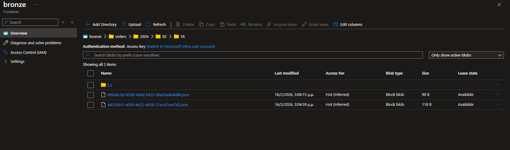
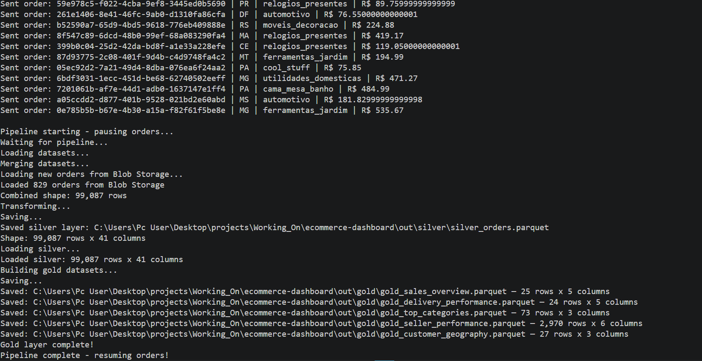
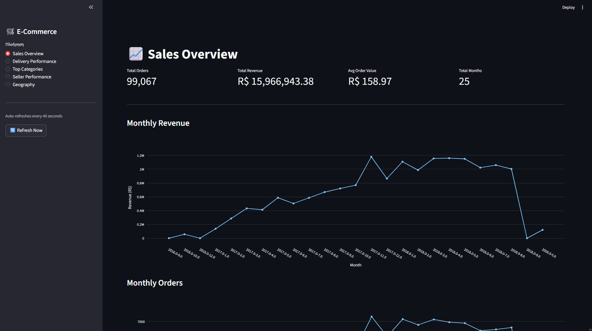
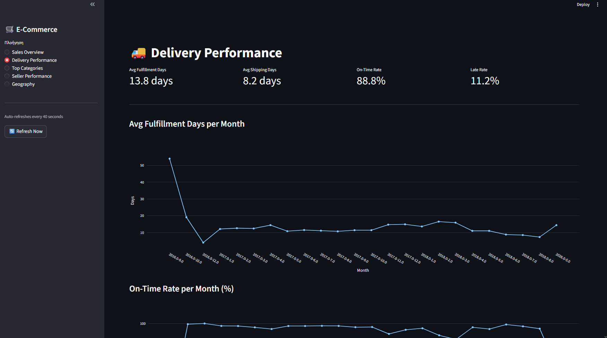
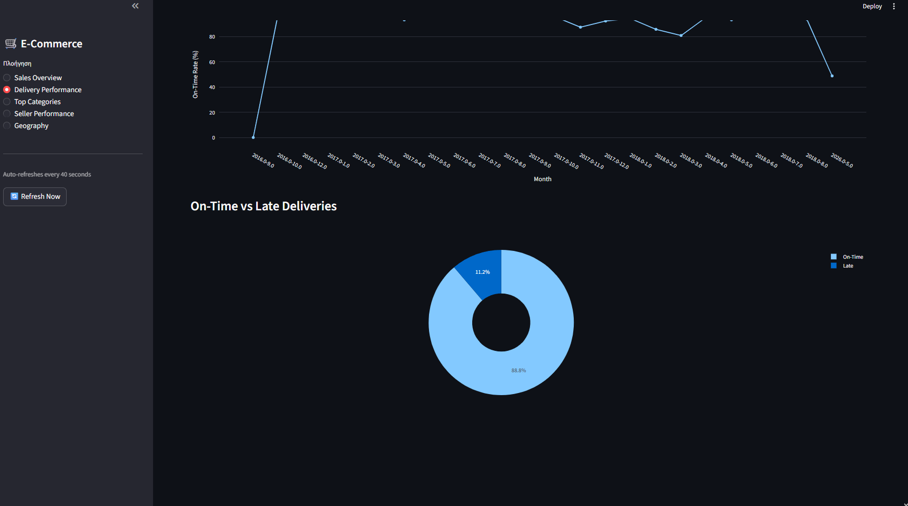
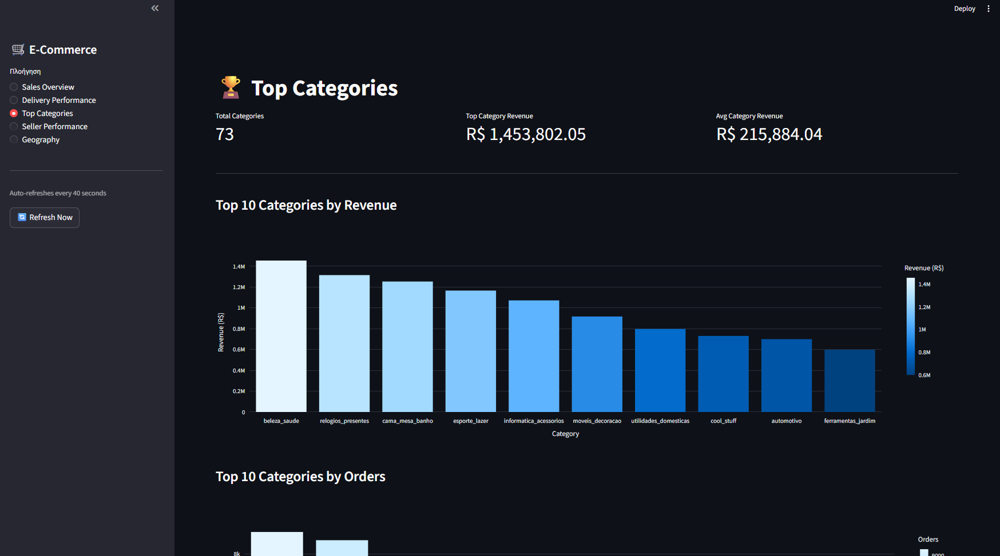
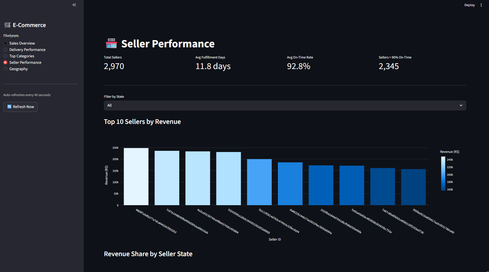
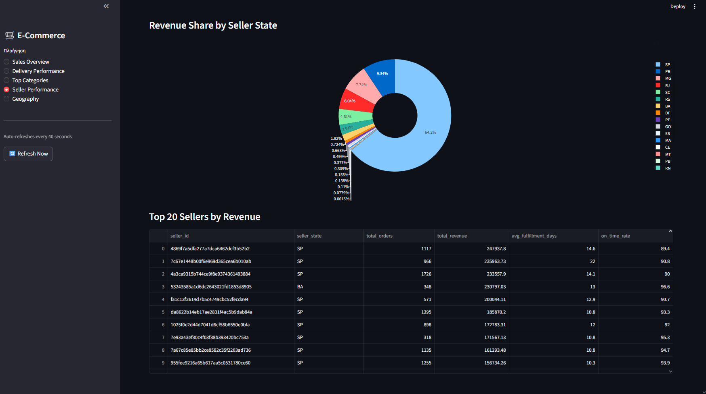
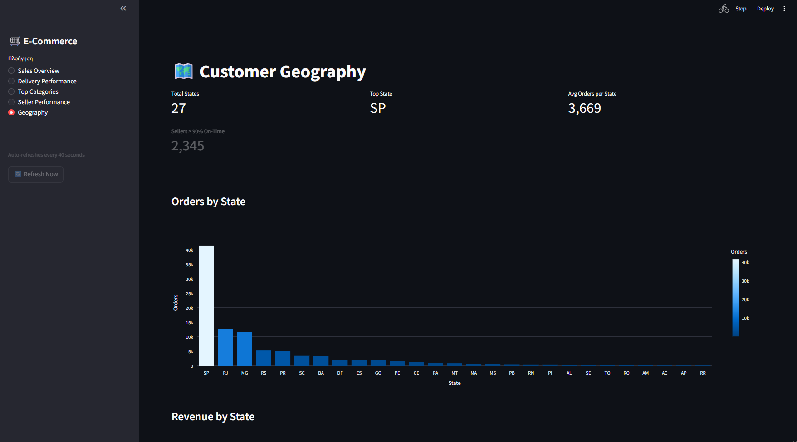
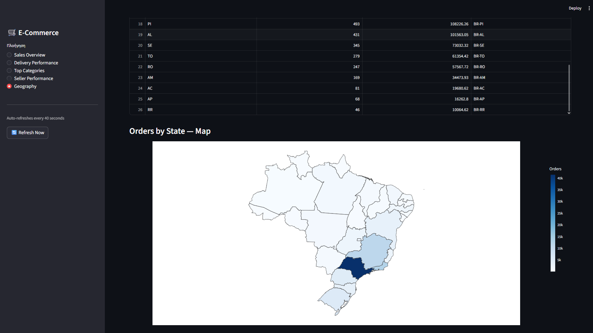

# E-Commerce Data Engineering Dashboard

A data engineering pipeline built with Python and Azure that processes real Brazilian e-commerce data and visualizes it in a live dashboard. The pipeline follows Medallion Architecture (Bronze, Silver, Gold) with real-time ingestion via Azure Event Hub.

---

## Architecture

```
Olist CSV Dataset
       |
send_orders.py  →  Azure Event Hub  →  Azure Function  →  Blob Storage (bronze/)
                                                                    |
                                                       silver_transformer.py
                                                       (merge, clean, enrich)
                                                                    |
                                                         silver_orders.parquet
                                                                    |
                                                         gold_aggregator.py
                                                         (5 aggregated datasets)
                                                                    |
                                                           gold/*.parquet
                                                                    |
                                                        Streamlit Dashboard
```

---

## Tech Stack

Python, Pandas, PyArrow, Azure Event Hub, Azure Blob Storage, Azure Functions, Streamlit, Plotly

---

## Project Structure

```
ecommerce-dashboard/
├── data/                          # Raw Olist CSV files
├── docs/images/                   # Screenshots
├── out/
│   ├── silver/                    # silver_orders.parquet
│   └── gold/                      # 5 aggregated parquet files
├── src/
│   ├── exploration/               # Exploratory scripts
│   ├── integration/               # data_integration.py
│   └── silver/                    # silver_transformer.py
├── src/gold/                      # gold_aggregator.py
├── functions/eventhub_to_blob/    # Azure Function
├── producer/                      # send_orders.py
├── dashboard/                     # app.py (Streamlit)
├── run_pipeline.py                # Pipeline runner
└── paths.py
```

---

## How It Works

**Bronze Layer**

`send_orders.py` reads orders from the Olist dataset and sends them one by one to Azure Event Hub, simulating a live e-commerce stream. An Azure Function picks up each event and stores it as a JSON file in Azure Blob Storage under `bronze/orders/year/month/day/`.



**Silver Layer**

`silver_transformer.py` loads all 6 CSV files, merges them into a single DataFrame, and pulls in any new orders from Blob Storage. It then computes new columns: delivery durations, SLA difference, on-time flag, and time features (year, month, weekday, hour). The result is saved as `silver_orders.parquet`.

**Gold Layer**

`gold_aggregator.py` reads the silver parquet and produces 5 aggregated datasets ready for the dashboard:

- `gold_sales_overview` — monthly orders and revenue
- `gold_delivery_performance` — avg fulfillment days and on-time rate per month
- `gold_top_categories` — revenue and orders by product category
- `gold_seller_performance` — revenue, fulfillment, on-time rate per seller
- `gold_customer_geography` — orders and revenue by Brazilian state

**Live Pipeline**

**Live Pipeline**

`send_orders.py` generates new fake orders with random data every 2 seconds and sends them to Azure Event Hub. Each order gets a unique ID and contains realistic fields: customer state, product category, seller, payment type, price, and delivery dates — all picked randomly from real values found in the Olist dataset.

Every 30 seconds the pipeline pauses order sending, runs `silver_transformer.py` and `gold_aggregator.py` to process the new data, then resumes. The Streamlit dashboard auto-refreshes every 40 seconds so the charts and KPIs update automatically without any manual action.


---

## Dashboard

The Streamlit dashboard auto-refreshes every 40 seconds and has 5 pages.

**Sales Overview** — monthly revenue and orders trend, top 5 categories pie chart



**Delivery Performance** — avg fulfillment days, shipping days, on-time vs late




**Top Categories** — top 10 categories by revenue and orders



**Seller Performance** — top sellers by revenue with state filter, revenue share by state




**Geography** — orders and revenue by Brazilian state, interactive choropleth map




---

## Setup

**1. Clone the repo**
```bash
git clone https://github.com/trif05/ecommerce-dashboard.git
cd ecommerce-dashboard
```

**2. Create virtual environment and install dependencies**
```bash
python -m venv .venv
.venv\Scripts\activate  # Windows
pip install -r requirements.txt
```

**3. Add the Olist CSV files to the `data/` folder**

Download from: https://www.kaggle.com/datasets/olistbr/brazilian-ecommerce

**4. Run the silver and gold pipeline**
```bash
python src/silver/silver_transformer.py
python src/gold/gold_aggregator.py
```

**5. Start the dashboard**
```bash
streamlit run dashboard/app.py
```

**6. (Optional) Start the live pipeline**

Add your Azure credentials to `producer/.env`:
```
EVENT_HUB_CONNECTION_STRING=...
EVENT_HUB_NAME=orders
AZURE_STORAGE_CONNECTION_STRING=...
```

Then run:
```bash
cd producer
python send_orders.py
```

---

## Dataset

Brazilian E-Commerce Public Dataset by Olist — 100k real orders from 2016 to 2018 across Brazil.

Source: https://www.kaggle.com/datasets/olistbr/brazilian-ecommerce

---

## What I'd Add Next

Orchestration with Apache Airflow or Azure Data Factory to schedule the pipeline automatically, and uploading the CSV files to Azure Blob Storage so the silver layer reads entirely from the cloud.
